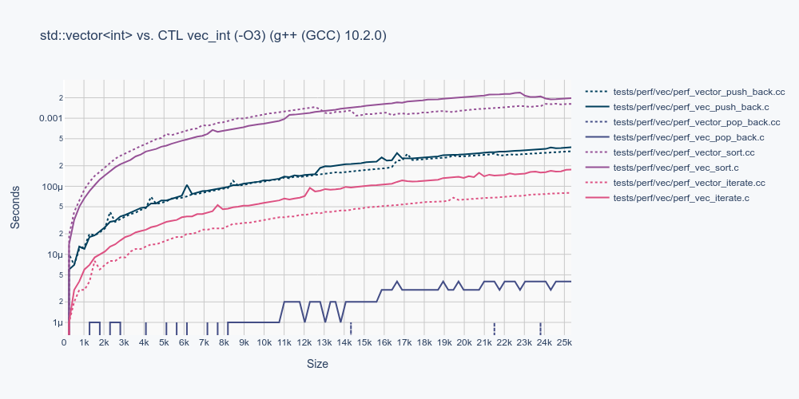
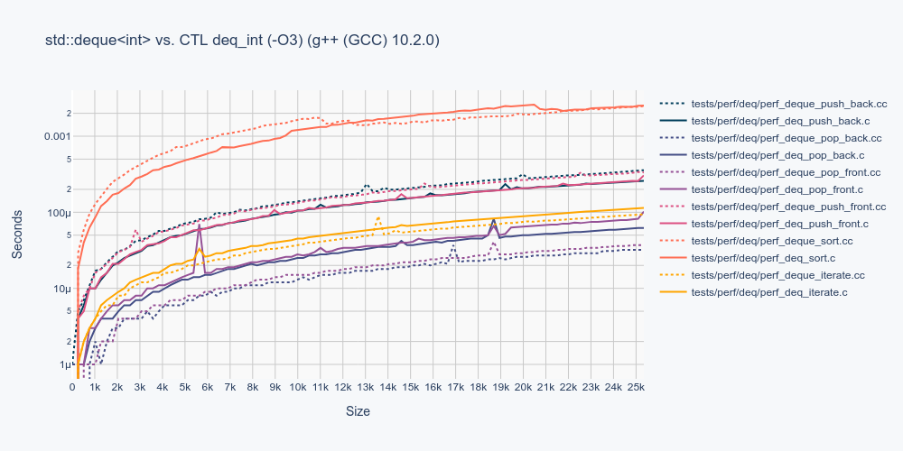
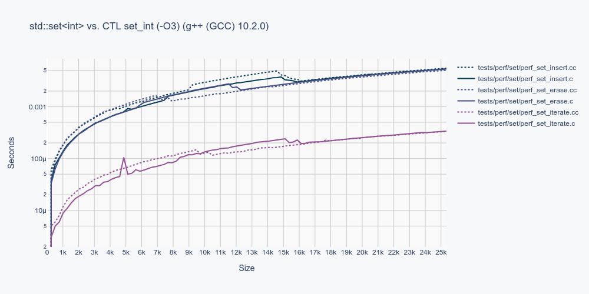
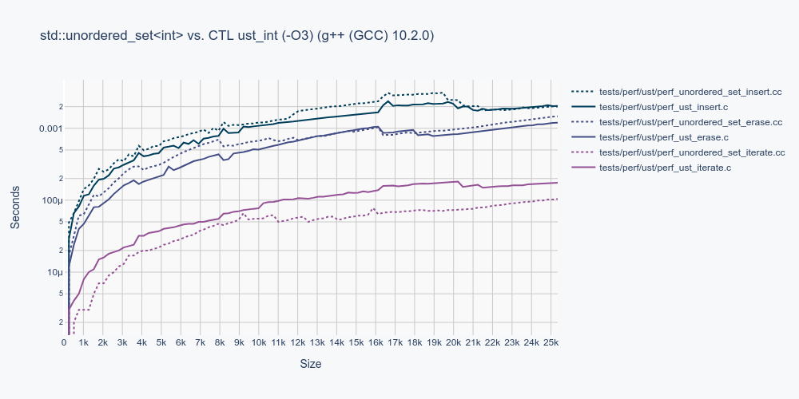
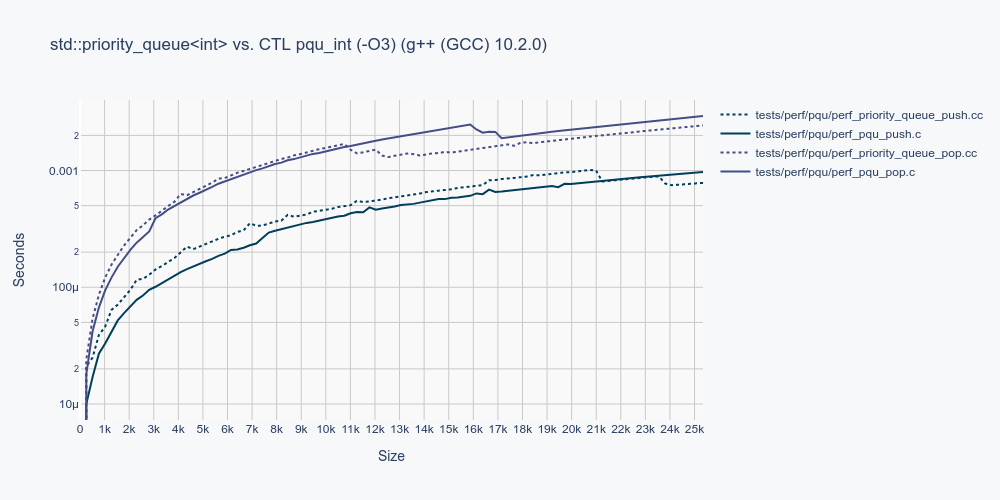

# C TEMPLATE LIBRARY (CTL)

CTL is a fast compiling, type safe, header only, template-like library for ISO C99/C11.

## Motivation

CTL aims to improve ISO C99/C11 developer productivity by implementing the following
STL containers in ISO C99/C11:

```
deq.h = std::deque
lst.h = std::list
pqu.h = std::priority_queue
que.h = std::queue
set.h = std::set
stk.h = std::stack
str.h = std::string
ust.h = std::unordered_set
vec.h = std::vector
```

## Use

Configure a CTL container with a built-in or typedef type `T`.

```C
#include <stdio.h>

#define P
#define T int
#include <vec.h>

int compare(int* a, int* b) { return *b < *a; }

int main(void)
{
    vec_int a = vec_int_init();
    vec_int_push_back(&a, 9);
    vec_int_push_back(&a, 1);
    vec_int_push_back(&a, 8);
    vec_int_push_back(&a, 3);
    vec_int_push_back(&a, 4);
    vec_int_sort(&a, compare);
    foreach(vec_int, &a, it)
        printf("%d\n", *it.ref);
    vec_int_free(&a);
}
```

Definition `P` states type `T` is Plain Old Data (POD).

To compile, include the `ctl` directory:

```shell
gcc main.c -I ctl
```

For a much more thorough getting started guide,
see the wiki: https://github.com/glouw/ctl/wiki

## Memory Ownership

Types with memory ownership require definition `P` be omitted, and require
function declarations for the C++ equivalent of the destructor and copy constructor,
prior to the inclusion of the container:

```C
typedef struct { ... } type;
void type_free(type*);
type type_copy(type*);
#define T type
#include <vec.h>
```

Forgetting a declaration will print a human-readable error message:

```shell
tests/test_c11.c:11:11: error: type_free undeclared (first use in this function)
   11 | #define T type
```

## Performance

CTL performance is presented in solid colors, and STL in dotted colors,
for template type `T` as type `int` for all measurements.









Omitted from these performance measurements are `que.h`, `stk.h`, and `str.h`,
as their performance characteristics can be inferred from `deq.h`, and `vec.h`,
respectively.

Note, CTL strings do not support short strings.

## Running Tests

To run all functional tests, run:

```shell
make
```

To compile examples, run:

```shell
make examples
```

To generate performance graphs, run:

```shell
sh gen_images.sh
# Graphing requires python3 and the Plotly family of libraries via pip.
pip install plotly
pip install psutil
pip install kaleido
```

To do all of the above in one step, run:

```shell
./all.sh
```

For maintaining CTL, a container templated to type `int` can be
outputted to `stdout` by running make on the container name, eg:

```shell
make deq
make lst
make pqu
make que
make set
make stk
make str
make ust
make vec
```

## Other

STL `std::map` will not be implemented in CTL because maps only provide slight
syntactic improvements over sets.

STL variants of multi-sets and multi-maps will not be implemented because
similar behaviour can be implemented as an amalgamation of a `set` and `lst`.

## Base Implementation Details

```
vec.h: realloc
str.h: vec.h
deq.h: realloc (paged)
que.h: deq.h
stk.h: deq.h
pqu.h: vec.h
lst.h: doubly linked list
set.h: red black tree
ust.h: hashed forward linked lists

                    vec  str  deq  lst  set  pqu  que  stk  ust
+-------------------------------------------------------------+
empty               x    x    x    x    x    x    x    x    x
each                x    x    x    x    x                   x
equal               x    x    x    x    x    x    x    x    x
swap                x    x    x    x    x    x    x    x    x
bucket                                                      x
bucket_size                                                 x
load_factor                                                 x
rehash                                                      x
insert              x    x    x    x    x                   x
init                x    x    x    x    x    x    x    x    x
free                x    x    x    x    x    x    x    x    x
step                x    x    x    x    x                   x
range               x    x    x    x    x                   x
find                x    x    x    x    x                   x
count                    x              x                   x
erase               x    x    x    x    x                   x
copy                x    x    x    x    x                   x
begin               x    x    x    x    x                   x
end                 x    x    x    x    x                   x
intersection                            x                   
union                                   x                   
difference                              x                   
symmetric_difference                    x                   
top                                          x         x
push                                         x    x    x
pop                                          x    x    x
at                  x    x    x
front               x    x    x    x              x
back                x    x    x    x              x
set                 x    x    x
pop_back            x    x    x    x
pop_front                     x    x
clear               x    x    x    x    x
reserve             x    x
push_back           x    x    x    x
push_front                    x    x
transfer                           x
disconnect                         x
connect                            x
resize              x    x    x    x
assign              x    x    x    x
reverse                            x
shrink_to_fit       x    x
data                x    x
erase_node                              x
sort                x    x    x    x
remove_if           x    x    x    x    x
splice                             x
merge                              x
unique                             x
append                   x
insert_str               x
replace                  x              x
c_str                    x
find                     x
rfind                    x
find_first_of            x
find_last_of             x
find_first_not_of        x
find_last_not_of         x
substr                   x
compare                  x
key_compare              x
```

## Acknowledgements

Thank you https://github.com/kully for the Plotly code, and thank you for the general review and manual testing.

Thank you `smlckz` for the `foreach` cleanup.
